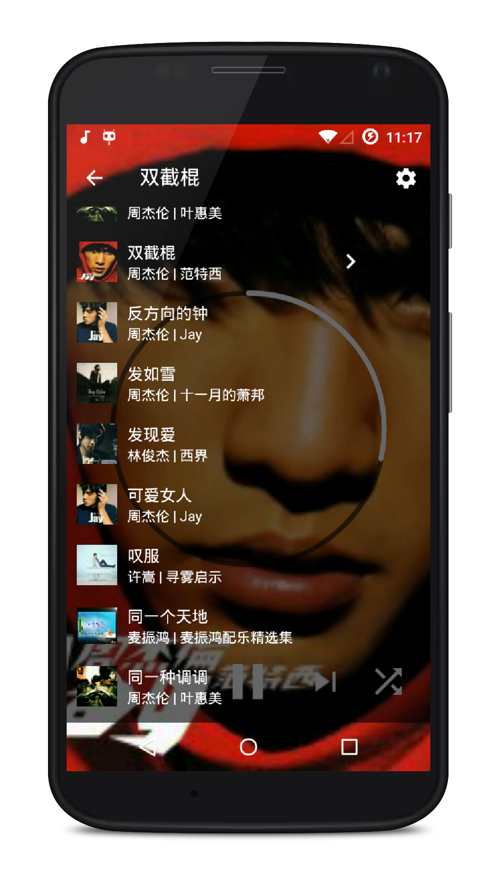

# PureMusic

本地音乐播放器，PureMusic，只有音乐

## 截图





## v2.0 版重构要点
* 全面使用 kotlin 语言；
* 只有一个入口 Activity，其他界面全部使用 Fragment；
* 使用 RxJava 切换线程、开启定时器，并配合 Retrofit 进行网络请求；
* 封装一个 RxBus 用于发送和接收消息，避免使用接口回调，降低耦合；
* 异步准备播放器，并使用 RxJava 封装，防止卡顿；
* 所有的图标都使用 svg 矢量图，减小安装包体积；
* 妹子图片全部放在服务器上，而不是放在包内，减小安装包体积体积,可以随时替换妹子图；
* 增加版本检测，当有新版本时，提示更新；
* 增加 bug 统计；
* 彻底解决内存泄漏问题；
* 退出的时候保存当前进度，下次再进入时直接从当前进度开始播放；
* 随机播放的时候，点击上一曲播放上次的音乐，而不是再随机播放；
* 适配 Android 8.0 渠道通知栏；
* 精选了一波 yurisa 图片做背景；
* 最重要的一点，解决各种内存泄露，各种性能优化，各种代码规范性和优雅性，把我的强迫症发挥到了极致。


## License
```
Copyright 2017 Zackratos

Licensed under the Apache License, Version 2.0 (the "License");
you may not use this file except in compliance with the License.
You may obtain a copy of the License at

    http://www.apache.org/licenses/LICENSE-2.0

Unless required by applicable law or agreed to in writing, software
distributed under the License is distributed on an "AS IS" BASIS,
WITHOUT WARRANTIES OR CONDITIONS OF ANY KIND, either express or implied.
See the License for the specific language governing permissions and
limitations under the License.
```
